# 📱 Mobile App Policy Checker - Complete Documentation

> **Tài liệu học tập toàn diện** về kiểm tra chính sách ứng dụng di động cho App Store và Google Play

---

## 📚 Mục Lục

1. [Giới Thiệu](#1-giới-thiệu)
2. [Kiến Trúc Hệ Thống](#2-kiến-trúc-hệ-thống)
3. [Luồng Xử Lý](#3-luồng-xử-lý)
4. [Cài Đặt & Sử Dụng](#4-cài-đặt--sử-dụng)
5. [Chi Tiết Kỹ Thuật](#5-chi-tiết-kỹ-thuật)
6. [Chính Sách App Store](#6-chính-sách-app-store)
7. [Chính Sách Google Play](#7-chính-sách-google-play)
8. [API Reference](#8-api-reference)
9. [Best Practices](#9-best-practices)
10. [Troubleshooting](#10-troubleshooting)

---

## 1. Giới Thiệu

### 1.1 Vấn Đề Cần Giải Quyết

Khi phát triển ứng dụng di động, developers thường gặp phải:

- ❌ App bị reject do vi phạm policy không biết trước
- ❌ Mất thời gian đọc hàng trăm trang guidelines
- ❌ Policy thay đổi liên tục, khó theo dõi
- ❌ Khác biệt giữa iOS và Android requirements

### 1.2 Giải Pháp

**Policy Checker** tự động:

- ✅ Quét project và phát hiện vi phạm policy
- ✅ Cập nhật policy mới nhất từ Apple & Google
- ✅ Hỗ trợ cả Expo và Flutter
- ✅ Tích hợp CI/CD pipeline

### 1.3 Tính Năng Chính

| Tính Năng | Mô Tả |
|-----------|-------|
| Auto-detect | Tự động nhận diện Expo/Flutter |
| Multi-platform | Kiểm tra iOS, Android hoặc cả hai |
| Live Updates | Tự động cập nhật policy hàng tuần |
| CI/CD Ready | Output JSON cho automation |
| Auto-fix | Tự động sửa một số lỗi |

---

## 2. Kiến Trúc Hệ Thống

### 2.1 Tổng Quan Architecture

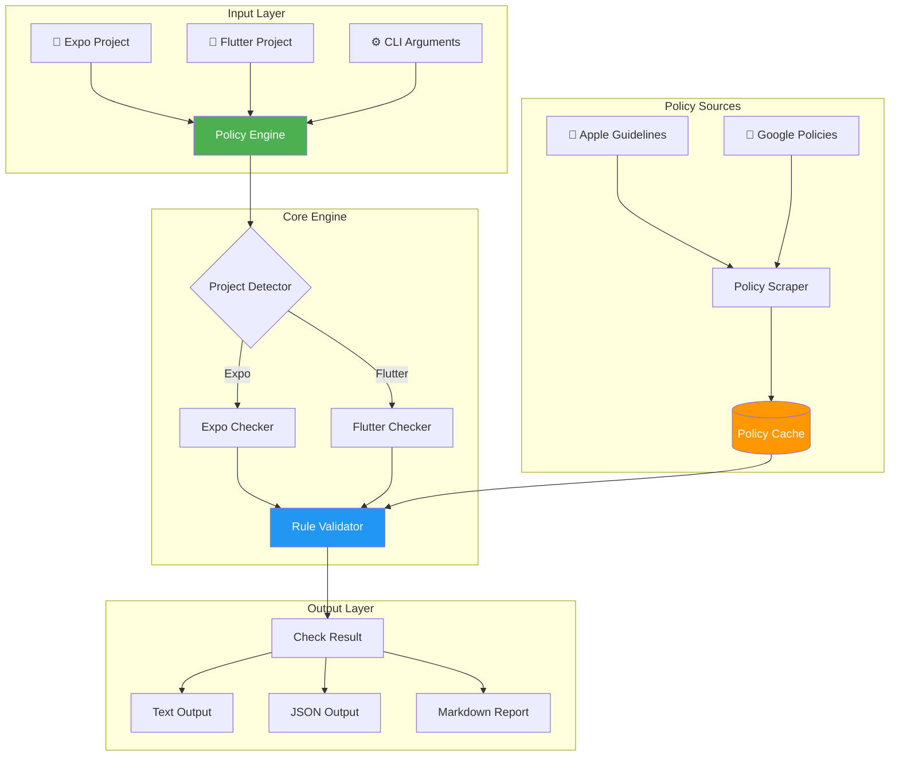

### 2.2 Component Diagram

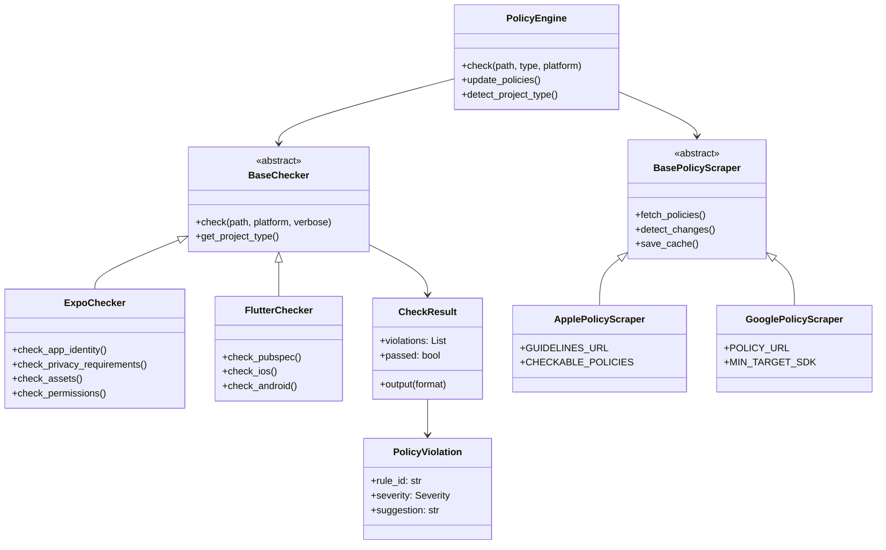

### 2.3 Directory Structure

```
policy-checker/
├── src/
│   ├── cli.py                    # Entry point
│   ├── checkers/
│   │   ├── __init__.py
│   │   ├── base.py               # Abstract base classes
│   │   ├── expo_checker.py       # Expo validation
│   │   ├── flutter_checker.py    # Flutter validation
│   │   └── policy_engine.py      # Orchestrator
│   ├── scrapers/
│   │   ├── __init__.py
│   │   ├── base_scraper.py       # Scraper base class
│   │   ├── apple_scraper.py      # Apple guidelines
│   │   └── google_scraper.py     # Google policies
│   ├── rules/
│   │   ├── appstore_rules.py     # iOS rules
│   │   └── playstore_rules.py    # Android rules
│   └── utils/
├── tests/
├── docs/
└── .github/workflows/
```

---

## 3. Luồng Xử Lý

### 3.1 Main Flow - Policy Check

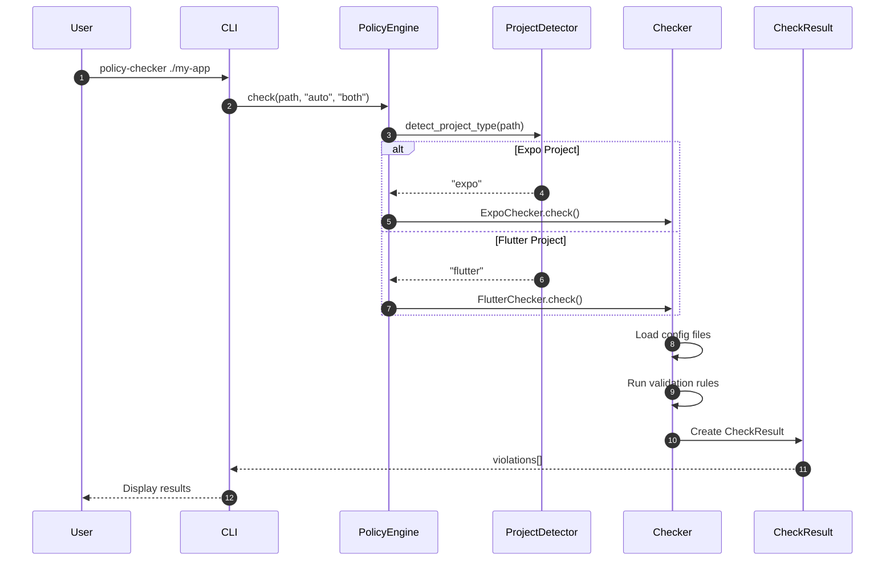

### 3.2 Policy Update Flow

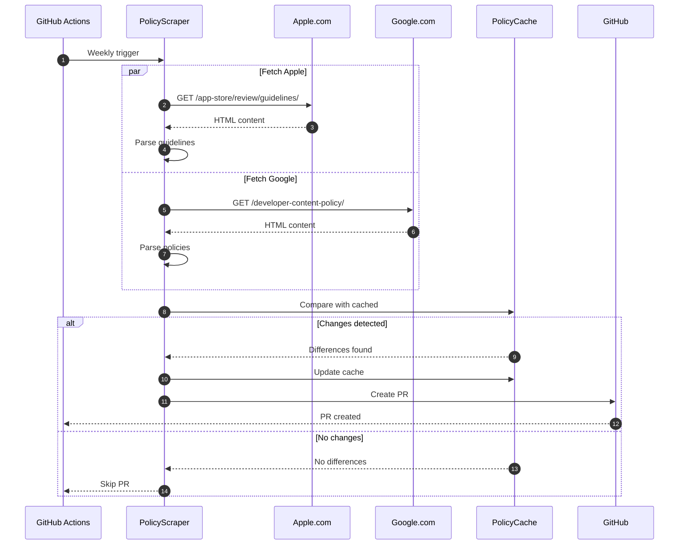

### 3.3 Expo Check Flow

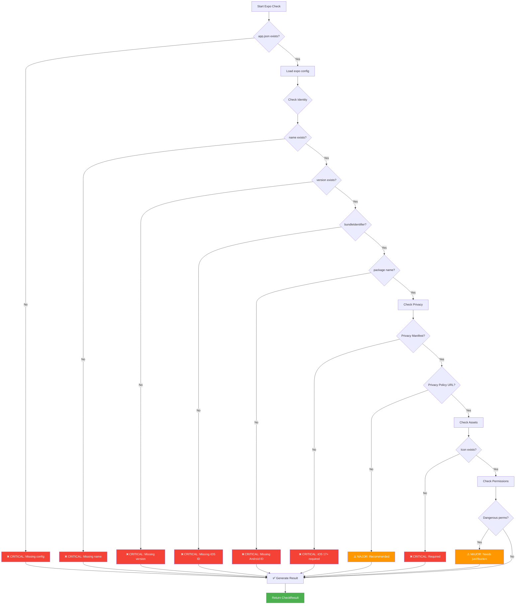

### 3.4 Severity Decision Flow

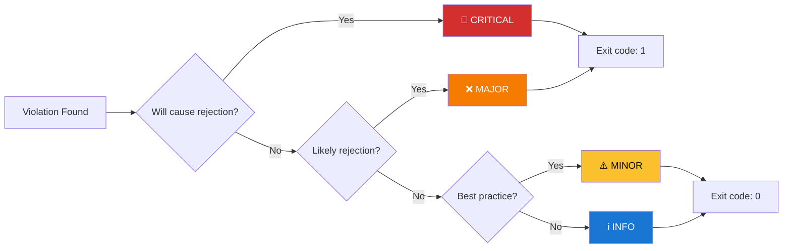

---

## 4. Cài Đặt & Sử Dụng

### 4.1 Installation

```bash
# Clone repository
git clone git@github.com:kiet-ta/policy-checker.git
cd policy-checker

# Install dependencies
pip install -r requirements.txt

# Install as CLI tool
pip install -e .
```

### 4.2 Basic Usage

```bash
# Auto-detect project type
policy-checker ./my-app

# Specify project type
policy-checker ./my-app --type expo
policy-checker ./my-app --type flutter

# Check specific platform
policy-checker ./my-app --platform ios
policy-checker ./my-app --platform android

# Output formats
policy-checker ./my-app --output json
policy-checker ./my-app --output markdown
```

### 4.3 CI/CD Integration

```yaml
# .github/workflows/policy-check.yml
name: Policy Check

on: [push, pull_request]

jobs:
  check:
    runs-on: ubuntu-latest
    steps:
      - uses: actions/checkout@v4
      - uses: actions/setup-python@v5
        with:
          python-version: '3.11'
      
      - name: Install policy-checker
        run: pip install policy-checker
      
      - name: Run policy check
        run: policy-checker . --output json > policy-report.json
      
      - name: Upload report
        uses: actions/upload-artifact@v3
        with:
          name: policy-report
          path: policy-report.json
```

### 4.4 Command Reference

| Command | Description |
|---------|-------------|
| `policy-checker <path>` | Check project at path |
| `policy-checker check <path>` | Explicit check command |
| `policy-checker update-policies` | Fetch latest policies |
| `--type, -t` | Project type: expo, flutter, auto |
| `--platform, -p` | Platform: ios, android, both |
| `--output, -o` | Output: text, json, markdown |
| `--verbose, -v` | Verbose output |
| `--fix` | Auto-fix issues |
| `--version` | Show version |

---

## 5. Chi Tiết Kỹ Thuật

### 5.1 Data Classes

```python
@dataclass
class PolicyViolation:
    """Đại diện cho một vi phạm policy."""
    rule_id: str           # ID duy nhất: "IOS_001"
    title: str             # Tiêu đề ngắn gọn
    message: str           # Mô tả chi tiết
    severity: Severity     # CRITICAL, MAJOR, MINOR, INFO
    category: str          # identity, privacy, assets, etc.
    file: Optional[str]    # File liên quan
    line: Optional[int]    # Dòng code
    suggestion: str        # Gợi ý sửa lỗi
    auto_fixable: bool     # Có thể tự động sửa?
    documentation_url: str # Link tài liệu
```

### 5.2 Severity Levels

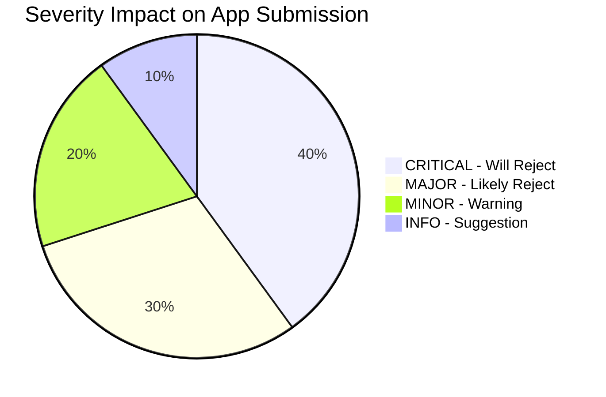

| Level | Impact | Action Required |
|-------|--------|-----------------|
| 🚫 CRITICAL | App WILL be rejected | Must fix before submit |
| ❌ MAJOR | App likely rejected | Should fix |
| ⚠️ MINOR | Warning only | Recommended to fix |
| ℹ️ INFO | Informational | Optional improvement |

### 5.3 Exit Codes

| Code | Meaning |
|------|---------|
| 0 | All checks passed (no CRITICAL/MAJOR) |
| 1 | Has CRITICAL or MAJOR violations |
| 2 | Invalid arguments or path not found |

---

## 6. Chính Sách App Store (iOS)

### 6.1 Các Policy Được Kiểm Tra

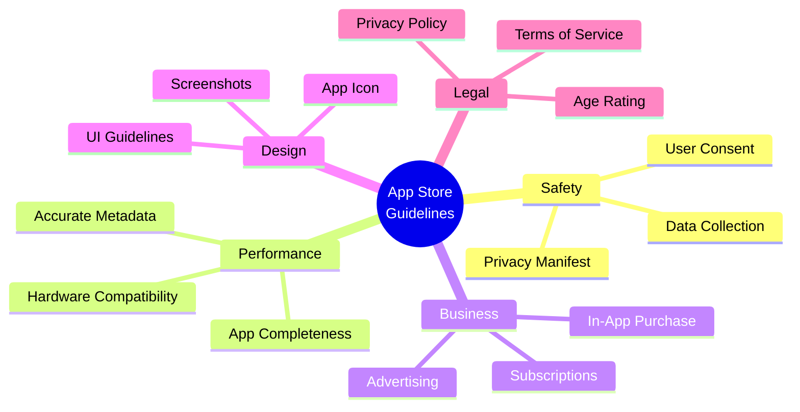

### 6.2 Privacy Manifest (iOS 17+)

**Bắt buộc từ Spring 2024:**

```xml
<!-- PrivacyInfo.xcprivacy -->
<?xml version="1.0" encoding="UTF-8"?>
<!DOCTYPE plist PUBLIC "-//Apple//DTD PLIST 1.0//EN" "...">
<plist version="1.0">
<dict>
    <key>NSPrivacyAccessedAPITypes</key>
    <array>
        <dict>
            <key>NSPrivacyAccessedAPIType</key>
            <string>NSPrivacyAccessedAPICategoryUserDefaults</string>
            <key>NSPrivacyAccessedAPITypeReasons</key>
            <array>
                <string>CA92.1</string>
            </array>
        </dict>
    </array>
</dict>
</plist>
```

### 6.3 Required API Reasons

| API Category | Common Reason Codes |
|--------------|---------------------|
| File Timestamp | DDA9.1, C617.1 |
| System Boot Time | 35F9.1 |
| Disk Space | E174.1, 85F4.1 |
| Active Keyboards | 54BD.1 |
| User Defaults | CA92.1, 1C8F.1 |

---

## 7. Chính Sách Google Play (Android)

### 7.1 Target SDK Requirements

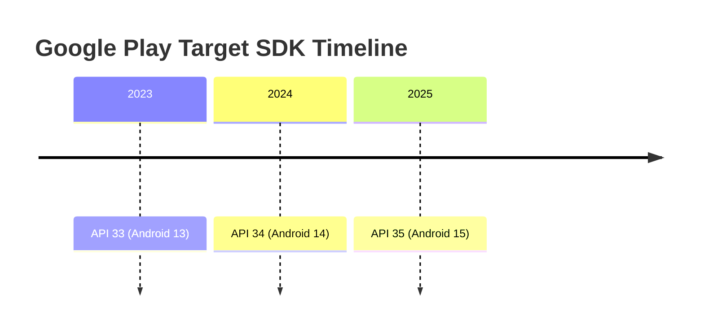

### 7.2 Data Safety Requirements

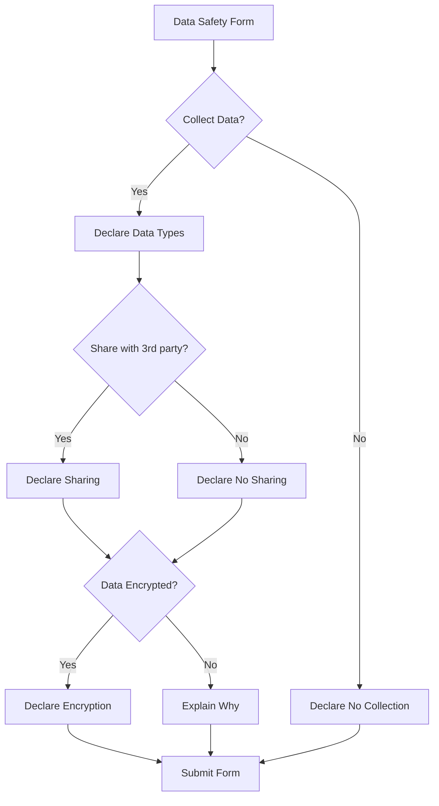

### 7.3 Dangerous Permissions

| Permission | Requires Justification |
|------------|----------------------|
| CAMERA | Yes - Photo/Video feature |
| RECORD_AUDIO | Yes - Voice feature |
| ACCESS_FINE_LOCATION | Yes - Location feature |
| READ_CONTACTS | Yes - Contact feature |
| READ_PHONE_STATE | Yes - Call feature |

---

## 8. API Reference

### 8.1 PolicyEngine

```python
from checkers.policy_engine import PolicyEngine

engine = PolicyEngine(auto_update=True)

# Check a project
result = engine.check(
    path="./my-app",
    project_type="auto",  # or "expo", "flutter"
    platform="both",      # or "ios", "android"
    verbose=False
)

# Access results
print(result.passed)           # True/False
print(result.critical_count)   # Number of critical issues
print(result.violations)       # List of PolicyViolation

# Output in different formats
result.output("text")      # Human readable
result.output("json")      # For CI/CD
result.output("markdown")  # For reports
```

### 8.2 Custom Checker

```python
from checkers.base import BaseChecker, CheckResult, PolicyViolation, Severity

class CustomChecker(BaseChecker):
    def get_project_type(self) -> str:
        return "custom"
    
    def check(self, path, platform="both", verbose=False) -> CheckResult:
        result = CheckResult(
            project_type="custom",
            project_path=str(path),
            platform=platform
        )
        
        # Add custom validation logic
        if not (path / "required_file.txt").exists():
            result.add_violation(PolicyViolation(
                rule_id="CUSTOM_001",
                title="Missing Required File",
                message="required_file.txt is missing",
                severity=Severity.CRITICAL,
                category="configuration"
            ))
        
        return result
```

---

## 9. Best Practices

### 9.1 Pre-submission Checklist

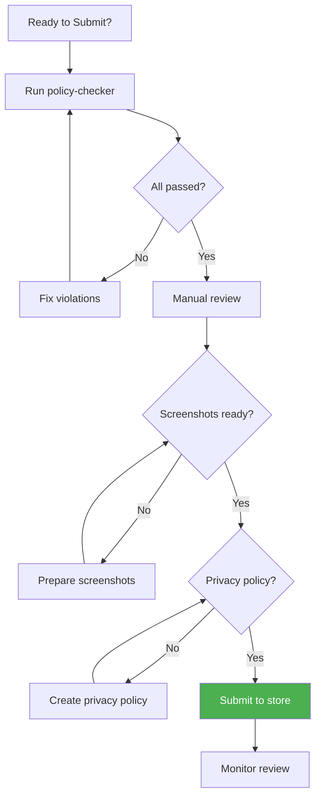

### 9.2 Recommended Workflow

1. **Development**: Run `policy-checker` locally
2. **PR**: Automated check in CI
3. **Pre-release**: Full check with `--verbose`
4. **Release**: Generate markdown report

### 9.3 Common Mistakes to Avoid

| Mistake | Solution |
|---------|----------|
| Missing Privacy Manifest | Add PrivacyInfo.xcprivacy |
| Low targetSdkVersion | Update to 34+ |
| No privacy policy URL | Add to app config |
| Missing app icon | Add 1024x1024 PNG |
| Hardcoded API keys | Use environment variables |

---

## 10. Troubleshooting

### 10.1 Common Errors

**Error: Could not detect project type**
```bash
# Solution: Specify type explicitly
policy-checker ./my-app --type expo
```

**Error: Privacy Manifest missing**
```bash
# Solution for Expo: Add to app.json
{
  "expo": {
    "ios": {
      "infoPlist": {
        "NSPrivacyAccessedAPITypes": [...]
      }
    }
  }
}
```

**Error: targetSdkVersion too low**
```gradle
// Solution: Update build.gradle
android {
    defaultConfig {
        targetSdkVersion 34
    }
}
```

### 10.2 Debug Mode

```bash
# Enable verbose output
policy-checker ./my-app --verbose

# Output JSON for debugging
policy-checker ./my-app --output json | jq .
```

---

## 📖 Glossary

| Term | Definition |
|------|------------|
| **Bundle Identifier** | Unique iOS app ID (com.company.app) |
| **Package Name** | Unique Android app ID |
| **Privacy Manifest** | iOS 17+ file declaring API usage |
| **Target SDK** | Android API level app targets |
| **Data Safety** | Google Play data collection form |

---

## 🔗 Official Resources

- [Apple App Store Review Guidelines](https://developer.apple.com/app-store/review/guidelines/)
- [Apple Privacy Manifest](https://developer.apple.com/documentation/bundleresources/privacy_manifest_files)
- [Google Play Developer Policy](https://play.google.com/about/developer-content-policy/)
- [Android Target SDK Requirements](https://developer.android.com/google/play/requirements/target-sdk)

---

*Documentation version: 2.0.0 | Last updated: 2024*
