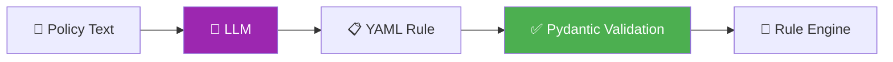
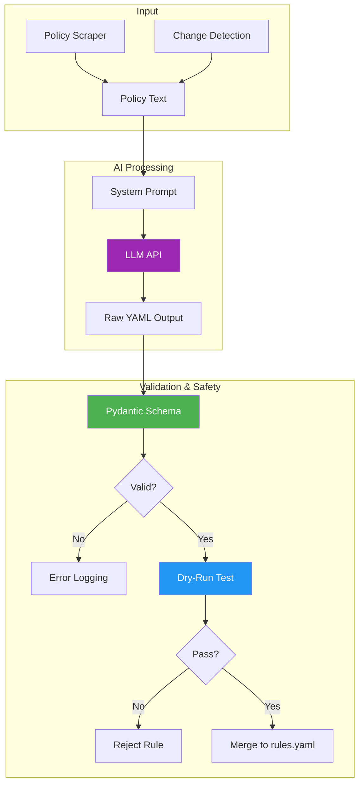
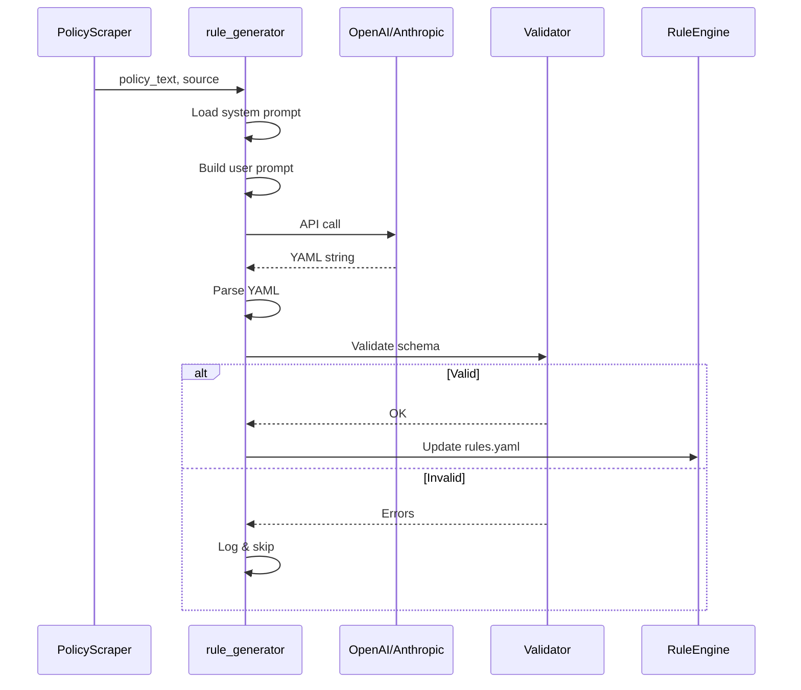
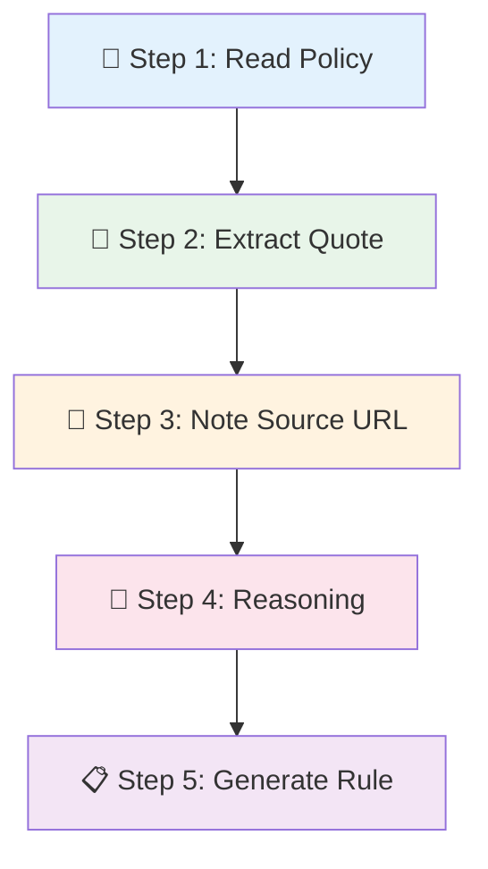
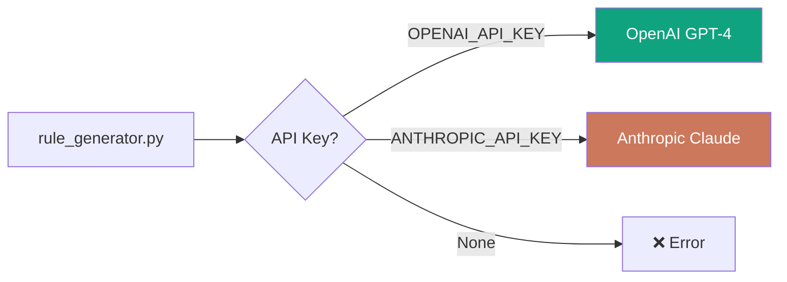
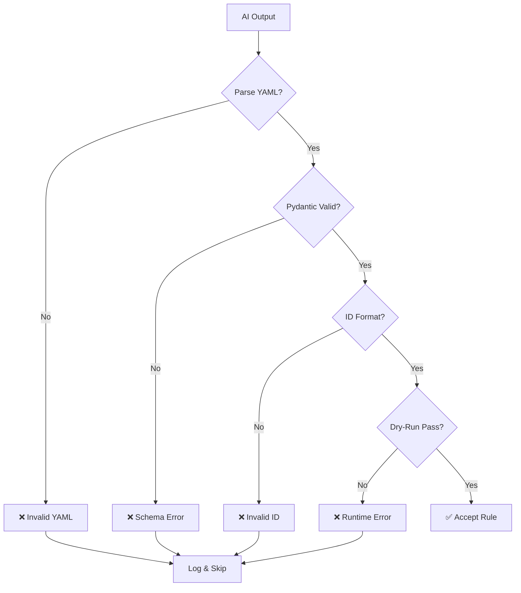
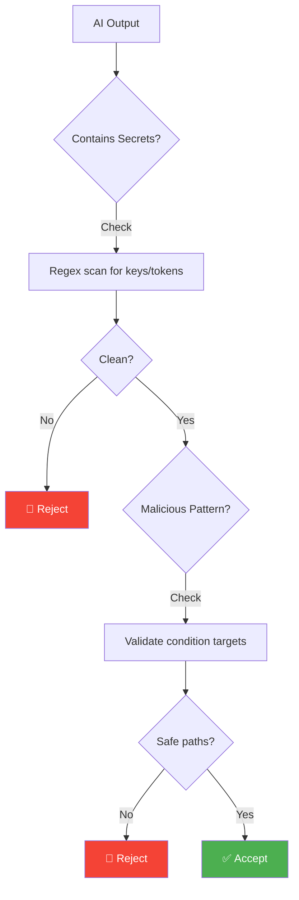

# 🤖 AI Integration - Tích Hợp AI Sinh Rules

> **Tài liệu kỹ thuật** về cách sử dụng LLM để tự động sinh policy rules từ tài liệu Apple/Google

---

## 📚 Mục Lục

1. [Tổng Quan](#1-tổng-quan)
2. [Kiến Trúc AI Integration](#2-kiến-trúc-ai-integration)
3. [Prompt Engineering](#3-prompt-engineering)
4. [Chain-of-Thought Pattern](#4-chain-of-thought-pattern)
5. [LLM API Integration](#5-llm-api-integration)
6. [Output Validation](#6-output-validation)
7. [Best Practices](#7-best-practices)

---

## 1. Tổng Quan

### 1.1 Vấn Đề

Policy từ Apple và Google:
- 📜 Được viết bằng ngôn ngữ tự nhiên
- 🔄 Thay đổi thường xuyên
- 📖 Rất dài và phức tạp

**Thách thức:** Làm sao chuyển policy text → machine-checkable rules?

### 1.2 Giải Pháp: AI-Powered Rule Generation



### 1.3 Lợi Ích

| Truyền thống | AI-Powered |
|--------------|------------|
| Đọc policy thủ công | Auto-parse policy |
| Viết rule bằng tay | AI sinh rule |
| Mất vài giờ/rule | Vài giây/rule |
| Dễ bỏ sót | Comprehensive |

---

## 2. Kiến Trúc AI Integration

### 2.1 Component Diagram



### 2.2 File Structure

```
src/ai/
├── __init__.py
├── rule_generator.py     # Main AI logic
└── prompts/
    └── rule_generator.md # System prompt

scripts/
├── ai_update_rules.py    # CLI script
└── validate_new_rules.py # Dry-run validation
```

### 2.3 Luồng Xử Lý Chi Tiết



---

## 3. Prompt Engineering

### 3.1 System Prompt Structure

```markdown
# System Prompt: Policy-to-Rule Converter

## Role Definition
Bạn là chuyên gia phân tích policy, chuyển đổi 
tài liệu Apple/Google thành rules machine-checkable.

## Input Specification
1. Policy Source: Apple hoặc Google
2. Policy Text: Nội dung policy
3. Change Type: added, modified, deprecated

## Output Specification
- Output ONLY valid YAML
- Không giải thích, không code fences

## Schema Definition
[Chi tiết schema YAML]

## Available Condition Types
[Bảng tham chiếu condition types]

## Examples
[Few-shot examples]

## Critical Instructions
[Hard constraints]
```

### 3.2 User Prompt Template

```python
user_prompt = f"""Policy Source: {source.upper()}
Change Type: {change_type}
Policy Text:
---
{policy_text}
---

Convert this to a rule YAML."""
```

### 3.3 Few-Shot Examples

```yaml
# Example 1: iOS Privacy Manifest
INPUT:
  Policy Source: APPLE
  Policy Text: "Apps must include a Privacy Manifest..."

OUTPUT:
- id: "IOS_PRIV_001"
  platform: "ios"
  title: "Privacy Manifest Required"
  severity: "critical"
  conditions:
    - type: "file_exists"
      target: "ios/PrivacyInfo.xcprivacy"

# Example 2: Android Target SDK
INPUT:
  Policy Source: GOOGLE
  Policy Text: "New apps must target API 34..."

OUTPUT:
- id: "ANDROID_TECH_001"
  platform: "android"
  title: "Target SDK 34 Required"
  conditions:
    - type: "regex_in_file"
      target: "android/app/build.gradle"
      pattern: "targetSdk.*?3[4-9]"
```

---

## 4. Chain-of-Thought Pattern

### 4.1 Tại Sao Cần Chain-of-Thought?

**Vấn đề với Direct Prompting:**
```
Input: "Convert this policy to YAML"
→ AI output có thể thiếu context, không trace được reasoning
```

**Giải pháp Chain-of-Thought:**
```
Input: "Analyze step-by-step, then output YAML"
→ AI reasoning rõ ràng, output có thể verify
```

### 4.2 Chain-of-Thought Steps



### 4.3 Enhanced System Prompt với CoT

```markdown
## Chain-of-Thought Instructions

Trước khi output YAML, hãy thực hiện từng bước:

### Step 1: Read Policy
- Đọc và hiểu yêu cầu policy
- Xác định platform (iOS/Android/Both)
- Xác định severity (critical/major/minor/info)

### Step 2: Extract Quote
- Trích xuất đoạn văn bản GỐC quan trọng nhất
- Quote phải là nguyên văn từ source

### Step 3: Note Source URL
- Ghi nhận URL của tài liệu gốc
- Ví dụ: https://developer.apple.com/...

### Step 4: Reasoning
- Giải thích LOGIC kiểm tra
- Tại sao chọn condition type này?
- File nào cần check?

### Step 5: Generate Rule
- Output YAML theo schema
- Bao gồm metadata field

## Output Format với Metadata

```yaml
- id: "PLATFORM_CATEGORY_XXX"
  platform: "ios"
  title: "..."
  description: "..."
  severity: "critical"
  category: "privacy"
  
  # METADATA TRACEABILITY
  metadata:
    source_url: "https://developer.apple.com/..."
    quote: "Original policy text here..."
    ai_reasoning: "Explanation of why this check is needed..."
  
  conditions:
    - type: "file_exists"
      target: "..."
  
  suggestion: "..."
```

### 4.4 Ví Dụ Chain-of-Thought Output

```yaml
# AI Internal Reasoning (không output ra):
# Step 1: Policy yêu cầu Privacy Manifest cho iOS 17+
# Step 2: Quote: "Apps must include a Privacy Manifest..."
# Step 3: URL: developer.apple.com/documentation/...
# Step 4: Check file PrivacyInfo.xcprivacy hoặc config trong app.json
# Step 5: Generate rule với any_of condition

- id: "IOS_PRIV_001"
  platform: "ios"
  title: "Privacy Manifest Required"
  description: "iOS 17+ requires PrivacyInfo.xcprivacy"
  severity: "critical"
  category: "privacy"
  
  metadata:
    source_url: "https://developer.apple.com/documentation/bundleresources/privacy_manifest_files"
    quote: "Starting in Spring 2024, apps must include a privacy manifest file"
    ai_reasoning: |
      iOS 17 introduces Privacy Manifest requirement. Apps can satisfy this by:
      1. Having PrivacyInfo.xcprivacy file in ios/ directory
      2. Configuring NSPrivacyAccessedAPITypes in app.json for Expo
      Using any_of to allow both methods.
  
  conditions:
    - type: "any_of"
      checks:
        - type: "file_exists"
          target: "ios/PrivacyInfo.xcprivacy"
        - type: "json_path_exists"
          target: "app.json"
          path: "$.expo.ios.infoPlist.NSPrivacyAccessedAPITypes"
  
  suggestion: "Create PrivacyInfo.xcprivacy or add to app.json"
```

---

## 5. LLM API Integration

### 5.1 Supported Providers



### 5.2 OpenAI Integration

```python
from openai import OpenAI

def _call_openai(system_prompt: str, user_prompt: str, model: str):
    """Gọi OpenAI API để sinh rule YAML."""
    client = OpenAI()  # Tự động đọc OPENAI_API_KEY
    
    response = client.chat.completions.create(
        model=model,  # "gpt-4" recommended
        messages=[
            {"role": "system", "content": system_prompt},
            {"role": "user", "content": user_prompt}
        ],
        temperature=0.1,  # Low temp = consistent output
        max_tokens=2000
    )
    
    yaml_content = response.choices[0].message.content
    return parse_yaml(yaml_content)
```

### 5.3 Anthropic Integration

```python
import anthropic

def _call_anthropic(system_prompt: str, user_prompt: str, model: str):
    """Gọi Anthropic API để sinh rule YAML."""
    client = anthropic.Anthropic()  # Tự động đọc ANTHROPIC_API_KEY
    
    response = client.messages.create(
        model=model or "claude-sonnet-4-20250514",
        max_tokens=2000,
        system=system_prompt,
        messages=[{"role": "user", "content": user_prompt}]
    )
    
    yaml_content = response.content[0].text
    return parse_yaml(yaml_content)
```

### 5.4 YAML Parsing với Error Handling

```python
import yaml
import logging

logger = logging.getLogger(__name__)

def parse_yaml(content: str) -> Optional[List[Dict]]:
    """Parse YAML an toàn với error handling."""
    # Strip markdown code fences nếu có
    content = content.strip()
    if content.startswith("```"):
        content = content.split("\n", 1)[1]
    if content.endswith("```"):
        content = content.rsplit("```", 1)[0]
    
    try:
        result = yaml.safe_load(content)
        
        # Đảm bảo kết quả là list
        if isinstance(result, dict):
            return [result]
        return result
        
    except yaml.YAMLError as e:
        logger.error(f"Failed to parse YAML: {e}")
        logger.debug(f"Raw content:\n{content}")
        return None
```

---

## 6. Output Validation

### 6.1 Validation Flow



### 6.2 Pydantic Validation

```python
from pydantic import BaseModel, Field, field_validator
import re

class RuleMetadata(BaseModel):
    """Metadata cho traceability."""
    source_url: str = Field(..., description="URL tài liệu gốc")
    quote: str = Field(..., description="Trích dẫn nguyên văn")
    ai_reasoning: Optional[str] = Field(None, description="Giải thích logic AI")

class PolicyRule(BaseModel):
    """Rule model với validation chặt chẽ."""
    id: str
    platform: Platform
    title: str
    description: str
    severity: Severity
    category: str
    metadata: RuleMetadata  # Required for AI-generated
    conditions: List[Condition]
    suggestion: Optional[str] = None
    
    @field_validator('id')
    @classmethod
    def validate_id_format(cls, v: str) -> str:
        """ID phải viết hoa, không ký tự đặc biệt."""
        if not v.isupper() or not v.replace('_', '').isalnum():
            raise ValueError(
                f"ID must be UPPERCASE with only letters, numbers, underscores. "
                f"Got: {v}"
            )
        if '_' not in v:
            raise ValueError(
                f"ID must follow format PLATFORM_CATEGORY_XXX. Got: {v}"
            )
        return v
```

### 6.3 Validation Function

```python
def validate_ai_rule(rule_dict: Dict) -> Tuple[Optional[PolicyRule], List[str]]:
    """Validate rule từ AI output.
    
    Returns:
        (PolicyRule, []) nếu valid
        (None, errors) nếu invalid
    """
    errors = []
    
    try:
        rule = PolicyRule(**rule_dict)
        return rule, []
    except ValidationError as e:
        for error in e.errors():
            field = ".".join(str(loc) for loc in error["loc"])
            errors.append(f"{field}: {error['msg']}")
        return None, errors
```

### 6.4 Dry-Run Testing

```python
def dry_run_rule(rule: PolicyRule, dummy_project: Path) -> Tuple[bool, Optional[str]]:
    """Test rule trên dummy project.
    
    Returns:
        (True, None) nếu chạy thành công
        (False, error_msg) nếu có lỗi
    """
    try:
        from rules.rule_engine import RuleEngine, create_evaluator
        
        # Test từng condition
        for condition in rule.conditions:
            evaluator = create_evaluator(condition)
            # Chỉ cần chạy không crash
            _ = evaluator.evaluate(dummy_project)
        
        return True, None
        
    except Exception as e:
        return False, str(e)
```

---

## 7. Best Practices

### 7.1 Prompt Engineering Tips

| Tip | Lý Do |
|-----|-------|
| Temperature thấp (0.1) | Output consistent, deterministic |
| Few-shot examples | AI hiểu format mong muốn |
| Explicit constraints | Giảm hallucination |
| Chain-of-Thought | Reasoning có thể verify |

### 7.2 Error Handling

```python
def generate_rule_from_policy(policy_text: str, source: str) -> Optional[List[Dict]]:
    """Main function với comprehensive error handling."""
    
    # 1. Check API keys
    if not os.environ.get("OPENAI_API_KEY") and not os.environ.get("ANTHROPIC_API_KEY"):
        raise ValueError("No LLM API key found in environment")
    
    # 2. Load prompt
    try:
        system_prompt = load_system_prompt()
    except FileNotFoundError as e:
        logger.error(f"Prompt file missing: {e}")
        return None
    
    # 3. Call LLM với timeout
    try:
        result = call_llm(system_prompt, user_prompt)
    except TimeoutError:
        logger.error("LLM API timeout")
        return None
    except RateLimitError:
        logger.warning("Rate limited, will retry later")
        return None
    
    # 4. Validate output
    validated_rules = []
    for rule_dict in result:
        rule, errors = validate_ai_rule(rule_dict)
        if errors:
            logger.warning(f"Validation failed: {errors}")
            continue
        validated_rules.append(rule)
    
    return validated_rules
```

### 7.3 Logging Strategy

```python
import logging

# Configure structured logging
logging.basicConfig(
    level=logging.INFO,
    format="%(asctime)s - %(name)s - %(levelname)s - %(message)s"
)

logger = logging.getLogger(__name__)

# Log important events
logger.info("🔍 Processing policy: %s", policy_title)
logger.info("🤖 Calling LLM API: %s", model)
logger.info("✅ Generated rule: %s", rule_id)
logger.warning("⚠️ Validation error: %s", error)
logger.error("❌ API failed: %s", exception)
```

### 7.4 Security Considerations



**Kiểm tra:**
1. Không có hardcoded secrets trong output
2. File paths không trỏ ra ngoài project (path traversal)
3. Regex patterns không quá phức tạp (ReDoS)

---

## 🔗 Tài Liệu Liên Quan

- [rule-engine.md](./rule-engine.md) - Dynamic Rule Engine
- [security-hardening.md](./security-hardening.md) - Bảo mật và validation

---

*Documentation version: 1.0.0 | Last updated: 2026-02*
