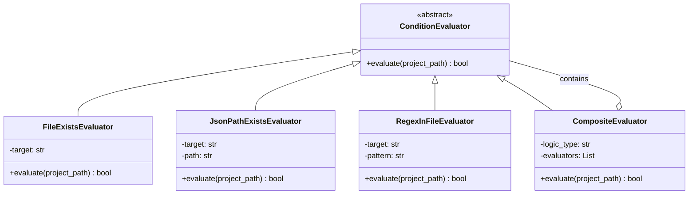
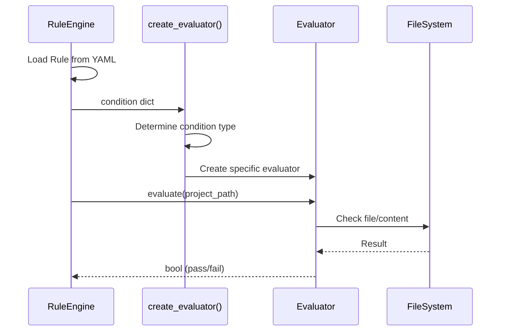
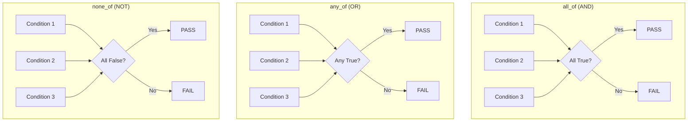
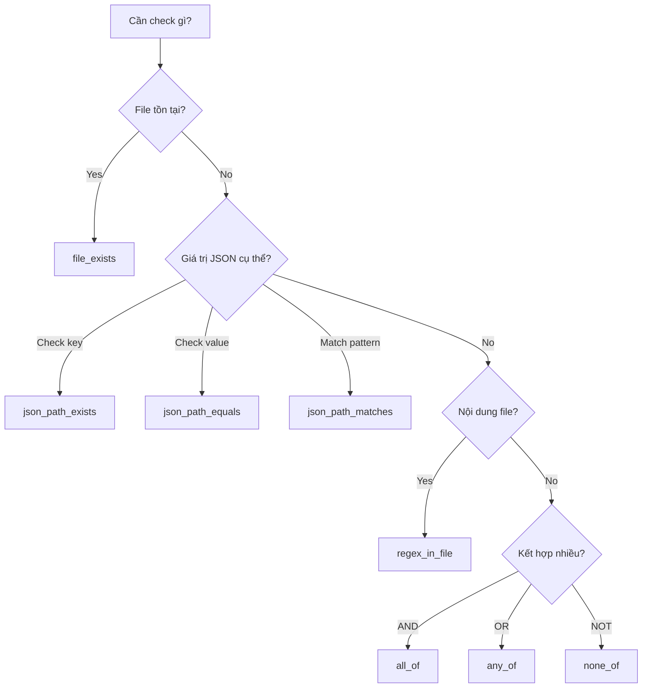

# 🎯 Dynamic Rule Engine - Chi Tiết Kỹ Thuật

> **Tài liệu học tập chuyên sâu** về Rule Engine sử dụng Interpreter Pattern cho Policy Checker

---

## 📚 Mục Lục

1. [Tổng Quan](#1-tổng-quan)
2. [Interpreter Pattern](#2-interpreter-pattern)
3. [Cấu Trúc Rules](#3-cấu-trúc-rules)
4. [Condition Types](#4-condition-types)
5. [Rule Engine API](#5-rule-engine-api)
6. [Tạo Rule Tùy Chỉnh](#6-tạo-rule-tùy-chỉnh)
7. [Best Practices](#7-best-practices)

---

## 1. Tổng Quan

### 1.1 Vấn Đề Với Hardcoded Rules

Trước đây, policy checks được viết trực tiếp trong code Python:

```python
# ❌ Hardcoded - Khó bảo trì và mở rộng
def check_privacy_manifest(project_path):
    if not (project_path / "ios/PrivacyInfo.xcprivacy").exists():
        return Violation("Missing Privacy Manifest")
```

**Nhược điểm:**
- 🔴 Thêm rule mới = Sửa code
- 🔴 Không thể cập nhật tự động từ AI
- 🔴 Khó test các rule riêng lẻ
- 🔴 Không có schema validation

### 1.2 Giải Pháp: Dynamic Rule Engine

```yaml
# ✅ Dynamic - Dễ bảo trì và mở rộng
- id: "IOS_PRIV_001"
  platform: "ios"
  title: "Privacy Manifest Required"
  conditions:
    - type: "file_exists"
      target: "ios/PrivacyInfo.xcprivacy"
```

**Ưu điểm:**
- ✅ Rules định nghĩa bằng YAML
- ✅ AI có thể sinh rules mới
- ✅ Schema validation với Pydantic
- ✅ Dễ test và debug

---

## 2. Interpreter Pattern

### 2.1 Khái Niệm

**Interpreter Pattern** cho phép đánh giá các biểu thức bằng cách biểu diễn ngữ pháp dưới dạng cây đối tượng.



### 2.2 Luồng Đánh Giá



### 2.3 Implementation

```python
from abc import ABC, abstractmethod
from pathlib import Path

class ConditionEvaluator(ABC):
    """Abstract base class - Interface cho mọi evaluator."""
    
    @abstractmethod
    def evaluate(self, project_path: Path) -> bool:
        """Đánh giá condition với project path."""
        pass


class FileExistsEvaluator(ConditionEvaluator):
    """Kiểm tra file tồn tại."""
    
    def __init__(self, condition):
        self.target = condition.target
    
    def evaluate(self, project_path: Path) -> bool:
        return (project_path / self.target).exists()


class CompositeEvaluator(ConditionEvaluator):
    """Kết hợp nhiều conditions với logic AND/OR/NOT."""
    
    def __init__(self, condition):
        self.logic_type = condition.type  # "all_of", "any_of", "none_of"
        self.evaluators = [create_evaluator(c) for c in condition.checks]
    
    def evaluate(self, project_path: Path) -> bool:
        results = [e.evaluate(project_path) for e in self.evaluators]
        
        if self.logic_type == "all_of":
            return all(results)  # AND logic
        elif self.logic_type == "any_of":
            return any(results)  # OR logic
        elif self.logic_type == "none_of":
            return not any(results)  # NOT logic
        
        return False
```

### 2.4 Factory Pattern

```python
def create_evaluator(condition) -> ConditionEvaluator:
    """Factory function tạo evaluator phù hợp với condition type."""
    
    evaluator_map = {
        "file_exists": FileExistsEvaluator,
        "file_not_exists": FileNotExistsEvaluator,
        "json_path_exists": JsonPathExistsEvaluator,
        "json_path_equals": JsonPathEqualsEvaluator,
        "json_path_matches": JsonPathMatchesEvaluator,
        "yaml_path_exists": YamlPathExistsEvaluator,
        "xml_xpath_exists": XmlXpathExistsEvaluator,
        "regex_in_file": RegexInFileEvaluator,
    }
    
    cond_type = condition.get("type") if isinstance(condition, dict) else condition.type
    
    # Composite conditions (đệ quy)
    if cond_type in ("all_of", "any_of", "none_of"):
        return CompositeEvaluator(condition)
    
    # Simple conditions
    if cond_type in evaluator_map:
        return evaluator_map[cond_type](condition)
    
    raise ValueError(f"Unknown condition type: {cond_type}")
```

---

## 3. Cấu Trúc Rules

### 3.1 Rule Schema

```yaml
# Cấu trúc đầy đủ của một Rule
- id: "PLATFORM_CATEGORY_XXX"    # ID duy nhất, viết hoa
  platform: "ios|android|both"   # Platform áp dụng
  title: "Short Title"           # Tiêu đề ngắn gọn
  description: "Long description" # Mô tả chi tiết
  severity: "critical|major|minor|info"
  category: "privacy|identity|assets|permissions|content|technical"
  source_url: "https://..."      # Link tài liệu chính thức
  auto_fixable: false            # Có thể tự động sửa không
  
  conditions:                    # Danh sách điều kiện
    - type: "condition_type"
      # ... params tùy loại
  
  suggestion: "How to fix"       # Gợi ý sửa lỗi
```

### 3.2 Ví Dụ Rules Thực Tế

```yaml
# Rule đơn giản - File tồn tại
- id: "IOS_BUNDLE_001"
  platform: "ios"
  title: "Missing Bundle Identifier"
  severity: "critical"
  category: "identity"
  conditions:
    - type: "json_path_exists"
      target: "app.json"
      path: "$.expo.ios.bundleIdentifier"
  suggestion: "Add 'ios.bundleIdentifier' to app.json"

# Rule phức tạp - OR logic
- id: "IOS_PRIV_001"
  platform: "ios"
  title: "Privacy Manifest Required"
  severity: "critical"
  category: "privacy"
  conditions:
    - type: "any_of"              # CHỈ CẦN 1 điều kiện đúng
      checks:
        - type: "json_path_exists"
          target: "app.json"
          path: "$.expo.ios.infoPlist.NSPrivacyAccessedAPITypes"
        - type: "file_exists"
          target: "ios/PrivacyInfo.xcprivacy"
  suggestion: "Add Privacy Manifest or configure in app.json"

# Rule với Regex
- id: "ANDROID_TECH_001"
  platform: "android"
  title: "Target SDK 34 Required"
  severity: "critical"
  category: "technical"
  conditions:
    - type: "regex_in_file"
      target: "android/app/build.gradle"
      pattern: "targetSdk(Version)?\\s*[=:]?\\s*3[4-9]"
  suggestion: "Update targetSdkVersion to 34+"
```

### 3.3 Pydantic Schema

```python
from pydantic import BaseModel, Field
from enum import Enum
from typing import List, Optional, Union, Literal

class Severity(str, Enum):
    CRITICAL = "critical"
    MAJOR = "major"
    MINOR = "minor"
    INFO = "info"

class Platform(str, Enum):
    IOS = "ios"
    ANDROID = "android"
    BOTH = "both"

# Condition Types
class FileExistsCondition(BaseModel):
    type: Literal["file_exists"] = "file_exists"
    target: str = Field(..., description="Relative path to file")

class JsonPathExistsCondition(BaseModel):
    type: Literal["json_path_exists"] = "json_path_exists"
    target: str
    path: str = Field(..., description="JSONPath expression")

class CompositeCondition(BaseModel):
    type: Literal["all_of", "any_of", "none_of"]
    checks: List["Condition"]

# Union của tất cả condition types
Condition = Union[
    FileExistsCondition,
    JsonPathExistsCondition,
    # ... more types
    CompositeCondition,
]

# Main Rule model
class Rule(BaseModel):
    id: str = Field(..., description="Unique ID like IOS_PRIV_001")
    platform: Platform = Platform.BOTH
    title: str
    description: str
    severity: Severity = Severity.MAJOR
    category: str
    source_url: Optional[str] = None
    auto_fixable: bool = False
    conditions: List[Condition]
    suggestion: Optional[str] = None
```

---

## 4. Condition Types

### 4.1 Bảng Tham Chiếu

| Type | Mục Đích | Parameters |
|------|----------|------------|
| `file_exists` | File tồn tại | `target` |
| `file_not_exists` | File KHÔNG tồn tại | `target` |
| `json_path_exists` | Key tồn tại trong JSON | `target`, `path` |
| `json_path_equals` | Value bằng giá trị | `target`, `path`, `value` |
| `json_path_matches` | Value khớp regex | `target`, `path`, `pattern` |
| `yaml_path_exists` | Key tồn tại trong YAML | `target`, `path` |
| `xml_xpath_exists` | XPath tồn tại | `target`, `xpath` |
| `regex_in_file` | Regex match trong file | `target`, `pattern` |
| `all_of` | TẤT CẢ phải đúng | `checks[]` |
| `any_of` | MỘT trong số đúng | `checks[]` |
| `none_of` | KHÔNG có cái nào đúng | `checks[]` |

### 4.2 JSONPath Syntax

```python
# Ví dụ JSONPath expressions
"$.expo.name"                    # expo.name
"$.expo.ios.bundleIdentifier"    # Nested key
"$.expo.plugins[0]"              # Array element
"$.expo.plugins[*].name"         # All plugin names
```

### 4.3 Composite Conditions



---

## 5. Rule Engine API

### 5.1 Khởi Tạo

```python
from rules.rule_engine import RuleEngine
from pathlib import Path

# Sử dụng rules mặc định
engine = RuleEngine()

# Sử dụng file rules tùy chỉnh
engine = RuleEngine(rules_path=Path("./custom_rules.yaml"))
```

### 5.2 Kiểm Tra Project

```python
# Kiểm tra tất cả rules
violations = engine.check_all(
    project_path=Path("./my-app"),
    platform="both"  # hoặc "ios", "android"
)

# Kết quả là list các Rule bị vi phạm
for rule in violations:
    print(f"❌ {rule.id}: {rule.title}")
    print(f"   Severity: {rule.severity.value}")
    print(f"   Suggestion: {rule.suggestion}")
```

### 5.3 Kiểm Tra Rule Đơn Lẻ

```python
# Lấy rule theo ID
rule = engine.get_rule_by_id("IOS_PRIV_001")

# Đánh giá rule
passed = engine.evaluate_rule(rule, project_path)
print(f"Rule {rule.id}: {'PASS' if passed else 'FAIL'}")
```

### 5.4 Reload Rules

```python
# Reload khi file YAML thay đổi
engine.reload_rules()
```

---

## 6. Tạo Rule Tùy Chỉnh

### 6.1 Thêm Rule Mới

```yaml
# Thêm vào rules.yaml
rules:
  # ... existing rules ...
  
  - id: "CUSTOM_SEC_001"
    platform: "both"
    title: "API Key Hardcoded"
    description: "Phát hiện API key hardcode trong code"
    severity: "critical"
    category: "security"
    conditions:
      - type: "none_of"  # Không được có pattern này
        checks:
          - type: "regex_in_file"
            target: "**/*.js"
            pattern: "apiKey\\s*[:=]\\s*['\"][a-zA-Z0-9]{20,}"
          - type: "regex_in_file"
            target: "**/*.ts"
            pattern: "apiKey\\s*[:=]\\s*['\"][a-zA-Z0-9]{20,}"
    suggestion: "Sử dụng environment variables thay vì hardcode"
```

### 6.2 Thêm Condition Type Mới

```python
# 1. Định nghĩa Pydantic model
class HttpStatusCondition(BaseModel):
    type: Literal["http_status"] = "http_status"
    url: str
    expected_status: int = 200

# 2. Tạo Evaluator
class HttpStatusEvaluator(ConditionEvaluator):
    def __init__(self, condition: HttpStatusCondition):
        self.url = condition.url
        self.expected_status = condition.expected_status
    
    def evaluate(self, project_path: Path) -> bool:
        try:
            import requests
            response = requests.head(self.url, timeout=5)
            return response.status_code == self.expected_status
        except Exception:
            return False

# 3. Đăng ký vào factory
evaluator_map["http_status"] = (HttpStatusCondition, HttpStatusEvaluator)
```

---

## 7. Best Practices

### 7.1 Đặt Tên Rule ID

```
FORMAT: {PLATFORM}_{CATEGORY}_{NUMBER}

PLATFORM:
- IOS      : iOS only
- ANDROID  : Android only
- COMMON   : Cả hai platform

CATEGORY:
- PRIV     : Privacy
- IDENT    : Identity
- ASSET    : Assets
- PERM     : Permissions
- TECH     : Technical
- SEC      : Security

VÍ DỤ:
- IOS_PRIV_001
- ANDROID_TECH_002
- COMMON_IDENT_001
```

### 7.2 Chọn Condition Type



### 7.3 Viết Regex An Toàn

```yaml
# ❌ Quá chung - False positives
- type: "regex_in_file"
  pattern: "password"

# ✅ Cụ thể hơn
- type: "regex_in_file"
  pattern: "password\\s*[:=]\\s*['\"][^'\"]{8,}"

# ❌ Case sensitive mặc định
- type: "regex_in_file"
  pattern: "APIKey"

# ✅ Case insensitive với (?i)
- type: "regex_in_file"
  pattern: "(?i)api_?key\\s*[:=]"
```

### 7.4 Tối Ưu Performance

```yaml
# ❌ Kiểm tra file lớn với regex phức tạp
- type: "regex_in_file"
  target: "node_modules/**/*.js"
  pattern: "..."

# ✅ Target cụ thể
- type: "regex_in_file"
  target: "src/config.js"
  pattern: "..."

# ✅ Sử dụng json_path thay vì regex cho JSON
- type: "json_path_exists"
  target: "package.json"
  path: "$.dependencies.react"
```

---

## 🔗 Tài Liệu Liên Quan

- [README.md](./README.md) - Tổng quan hệ thống
- [ai-integration.md](./ai-integration.md) - Tích hợp AI sinh rules
- [security-hardening.md](./security-hardening.md) - Bảo mật và validation

---

*Documentation version: 1.0.0 | Last updated: 2026-02*
