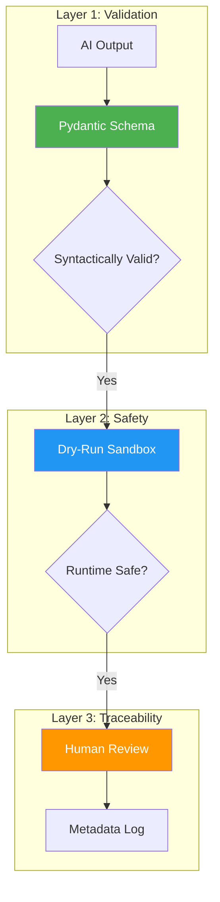
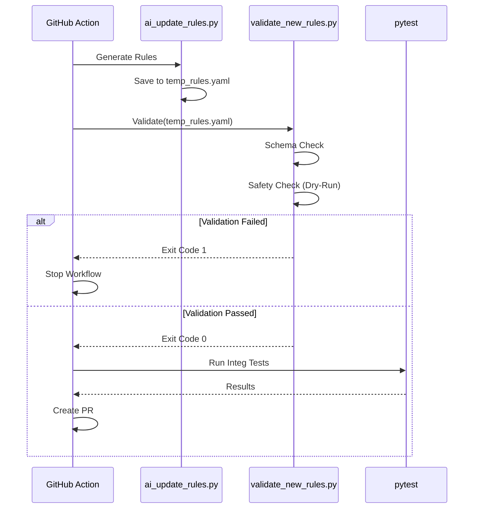

# 🔒 Security Hardening - Bảo Mật & Validation

> **Tài liệu toàn diện** về các biện pháp bảo vệ hệ thống khỏi rủi ro từ AI-generated rules.

---

## 📚 Mục Lục

1. [Tổng Quan](#1-tổng-quan)
2. [Validation Layer](#2-validation-layer)
3. [Safety Layer (Dry-Run)](#3-safety-layer-dry-run)
4. [Traceability Layer](#4-traceability-layer)
5. [CI/CD Integration](#5-cicd-integration)
6. [Attack Vectors & Mitigation](#6-attack-vectors--mitigation)

---

## 1. Tổng Quan

### 1.1 Tại Sao Cần Hardening?

Hệ thống cho phép AI tự động sinh và cập nhật rules chạy trực tiếp trên máy của user. Điều này tiềm ẩn rủi ro:

- ⚠️ **Malicious Rules**: AI bị prompt injection sinh rule độc hại (xóa file, gửi data ra ngoài).
- ⚠️ **Broken Rules**: Rule sai cú pháp làm crash tool của user.
- ⚠️ **Denial of Service (DoS)**: Rule dùng Regex quá phức tạp gây treo máy (ReDoS).

### 1.2 Chiến Lược Bảo Vệ 3 Lớp



---

## 2. Validation Layer

### 2.1 Pydantic Schema Mới

Chúng ta sử dụng `PolicyRule` class riêng biệt cho validation đầu vào, chặt chẽ hơn `Rule` class dùng trong runtime.

```python
# src/rules/schema.py

class PolicyRule(BaseModel):
    """Schema nghiêm ngặt cho AI output."""
    
    # ID phải viết hoa, format chuẩn
    id: str = Field(..., pattern=r"^[A-Z]+_[A-Z]+_\d{3}$")
    
    # Enum validation
    platform: Platform
    severity: Severity
    
    # Metadata bắt buộc
    metadata: RuleMetadata
    
    # Conditions validation
    conditions: List[Condition]
    
    @field_validator("conditions")
    @classmethod
    def validate_conditions(cls, v: List[Condition]):
        if not v:
            raise ValueError("Rule must have at least one condition")
        return v
```

### 2.2 Metadata Schema

```python
class RuleMetadata(BaseModel):
    """Thông tin truy vết nguồn gốc."""
    
    source_url: HttpUrl  # Phải là valid URL
    quote: str = Field(..., min_length=10)  # Quote phải đủ dài
    ai_reasoning: str
    
    @field_validator("source_url")
    @classmethod
    def validate_source(cls, v: HttpUrl):
        allowed_domains = ["apple.com", "google.com", "android.com"]
        if not any(d in str(v) for d in allowed_domains):
            raise ValueError(f"URL must be from trusted domains: {allowed_domains}")
        return v
```

### 2.3 Sanitization

Trước khi validate, chúng ta "khử trùng" input:

1. **Strip Markdown**: Loại bỏ code blocks.
2. **Trim Whitespace**: Xóa khoảng trắng thừa.
3. **Encoding Fixes**: Fix lỗi unicode phổ biến.

---

## 3. Safety Layer (Dry-Run)

### 3.1 Khái Niệm Dry-Run

Trước khi merge rule mới, chúng ta chạy thử nó trên môi trường giả lập (Sandbox).

**Mục tiêu:**
- Đảm bảo rule không crash engine.
- Đảm bảo regex không gây ReDoS (time out).
- Đảm bảo file paths an toàn.

### 3.2 Dummy Project Structure

```
tests/fixtures/dummy_project/
├── app.json                  # Mock Expo config
├── package.json              # Mock dependencies
├── ios/
│   ├── Podfile
│   └── PrivacyInfo.xcprivacy
└── android/
    ├── build.gradle
    └── app/src/main/AndroidManifest.xml
```

### 3.3 Script `validate_new_rules.py`

```python
def validate_rule_safety(rule: PolicyRule, timeout: int = 5):
    """Chạy rule với timeout để phòng chống ReDoS."""
    
    try:
        # Sử dụng multiprocessing hoặc signal để enforce timeout
        with time_limit(timeout):
            engine = RuleEngine()
            engine.evaluate_rule(rule, DUMMY_PROJECT_PATH)
            
        return True
    except TimeoutError:
        logger.error(f"Rule {rule.id} timed out! Possible ReDoS.")
        return False
    except Exception as e:
        logger.error(f"Rule {rule.id} crashed engine: {e}")
        return False
```

---

## 4. Traceability Layer

### 4.1 Metadata Logging

Mỗi rule được sinh ra phải kèm theo "Lý lịch trích ngang":

```yaml
- id: "IOS_PRIV_005"
  metadata:
    source_url: "https://developer.apple.com/documentation/..."
    quote: "Starting May 1, 2024, apps must declare..."
    ai_reasoning: "Rule check for required reason API usage..."
    generated_at: "2024-05-20T10:00:00Z"
    model_version: "gpt-4-turbo"
```

### 4.2 Human Review Process

GitHub Action tự động tạo PR, nhưng **không bao giờ tự merge**.

**Reviewer Checklist:**
1. Đọc description của PR (AI tóm tắt thay đổi).
2. Kiểm tra `metadata` có khớp với logic rule không.
3. Verify `source_url` là chính xác.
4. Approve PR.

---

## 5. CI/CD Integration

### 5.1 Workflow Pipeline



### 5.2 GitHub Action Configuration

```yaml
# .github/workflows/policy-update.yml

jobs:
  update-policy:
    steps:
      # ... steps ...
      
      - name: Dry Run Validation
        run: python scripts/validate_new_rules.py --file src/rules/rules.yaml
        
      - name: Create PR
        if: success()  # Chỉ tạo PR nếu validation pass
        uses: peter-evans/create-pull-request@v5
        with:
          title: "🛡️ Policy Update [Verified]"
          body: |
            ## Security Verification
            - Schema Validation: ✅ Passed
            - Dry-Run Safety: ✅ Passed
            - Source Domains: ✅ Trusted
```

---

## 6. Attack Vectors & Mitigation

| Attack Vector | Rủi ro | Biện pháp Mitigation |
|---------------|--------|----------------------|
| **Prompt Injection** | AI sinh rule xóa file user | Sandbox fs access, `file_exists` chỉ check, không xóa/sửa |
| **ReDoS** | Regex cực phức tạp làm treo CPU | Timeout cho mỗi regex execution (1s) |
| **Hallucination** | Rule sai policy làm user hoang mang | Bắt buộc `source_url` từ domain tin cậy |
| **Path Traversal** | Check file `../../etc/passwd` | Validate path không chứa `..` và bắt đầu bằng project root |
| **Malformed YAML** | Crash parser | Try/catch parser, validate schema trước khi load |
| **Resource Exhaustion** | Tạo 1 triệu rules | Giới hạn số lượng rules tối đa (e.g., 500 rules) |

### 6.1 Path Traversal Check implementation

```python
def is_safe_path(target: str) -> bool:
    """Kiểm tra path có an toàn không."""
    path = Path(target)
    if path.is_absolute():
        return False
    if ".." in target.split("/"):
        return False
    return True

# Sử dụng trong validation
@field_validator("target")
def validate_target(cls, v):
    if not is_safe_path(v):
        raise ValueError(f"Unsafe path detected: {v}")
    return v
```

---

## 🔗 Tài Liệu Liên Quan

- [rule-engine.md](./rule-engine.md) - Cấu trúc kỹ thuật
- [ai-integration.md](./ai-integration.md) - AI Generation Flow

---

*Documentation version: 1.0.0 | Last updated: 2026-02*
